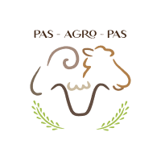
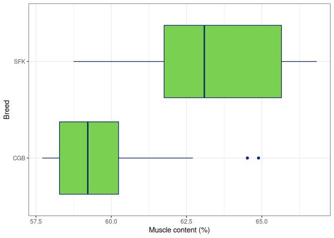

<!-- README.md is generated from README.Rmd. Please edit that file -->

# pasagropasr: Datasets from the PAS-AGRO-PAS Project <a href='https://github.com/PAS-AGRO-PAS/pasagropasr/'></a>

## Overview

The `pasagropasr` package provides a collection of datasets generated
through the research activities of the PAS-AGRO-PAS project. These
datasets are the result of collaborative work by all [PAS-AGRO-PAS
partners](https://www.ipb.pt/pas-agro-pas/).

The primary aim of this package is to make these datasets accessible to
the research community, serving as a valuable resource for training
young researchers and supporting studies in agriculture and
environmental sciences.

## Installation

You can install the latest stable version of the package from CRAN (if
available) or the development version from GitHub.

``` r
# Install devtools package if not already installed
install.packages("devtools")

# Install the latest development version from GitHub
devtools::install_github("PAS-AGRO-PAS/pasagropasr")
```

------------------------------------------------------------------------

### Dataset Descriptions

The package currently includes the following dataset:

| Dataset | Description |
|----|----|
| `lambBreeds` | Data on lamb carcass measurements and tissue composition, categorized by breed. |

Additional datasets may be added in future versions to enhance the
package’s utility for agricultural and environmental research.

## How to Use

Follow these steps to get started with the `pasagropasr` package:

1.  Install the package using CRAN or GitHub.
2.  Load the package using `library(pasagropasr)`.
3.  Load a dataset using the `data()` function.

Here is an example:

``` r
# Load the package
library(pasagropasr)

# Load the dataset
data(lambBreeds)

# Explore the structure of the dataset
str(lambBreeds)
#> 'data.frame':    40 obs. of  25 variables:
#>  $ Lamb : num  9810 9819 9853 9902 9905 ...
#>  $ Breed: chr  "CGB" "CGB" "CGB" "CGB" ...
#>  $ HCW  : num  14.48 13.86 9.06 9.98 10.19 ...
#>  $ F    : num  279 297 269 296 262 301 297 280 297 280 ...
#>  $ K    : num  745 753 656 730 690 799 809 770 802 735 ...
#>  $ G    : num  222 207 191 192 192 207 196 210 210 198 ...
#>  $ U    : num  651 638 561 607 582 ...
#>  $ CB   : num  598 567 504 495 500 567 536 580 559 513 ...
#>  $ C1   : num  2.7 3.2 2.8 1.3 0.9 1.5 1 1.4 1 0.5 ...
#>  $ C3   : num  5.4 4.1 2.3 2.15 4 2.6 2 3.35 2.45 1.2 ...
#>  $ C12  : num  2.3 2.1 2.5 1.5 1.45 1.4 1.2 1.7 1 0.5 ...
#>  $ BT2  : num  24.3 21.7 18.5 17.3 16.8 ...
#>  $ BT3  : num  20.4 21.7 17.6 16.3 15.9 17 20.3 20 18 13.6 ...
#>  $ BT4  : num  17.1 18.9 15.4 12.9 11.9 ...
#>  $ B1   : num  27.7 24.5 23.7 22.1 26.8 ...
#>  $ B3   : num  26.5 22.2 20.1 22.7 17.5 24.3 25.5 23.3 26.4 21 ...
#>  $ B12  : num  26.4 23.5 23.6 20.3 26.4 ...
#>  $ LEA1 : num  11.4 10.1 9.6 7.9 9.05 ...
#>  $ LEA3 : num  14.2 13.6 9.4 9.05 8.75 ...
#>  $ LEA12: num  12.8 10.75 10.1 7.15 9.7 ...
#>  $ MUS  : num  59.1 59.3 58.4 62.2 58.9 ...
#>  $ SF   : num  7.21 8.07 8.24 4.59 6.59 6.37 5.48 7.22 5.68 4.54 ...
#>  $ IF   : num  10.91 8.84 9.6 5.91 8.34 ...
#>  $ BO   : num  20.7 21.6 21.9 26.1 24.4 ...
#>  $ KKCF : num  2.1 2.11 1.83 1.18 1.79 1.92 1.77 1.93 1.51 1.32 ...
```

------------------------------------------------------------------------

### Plot Example

Here is an example of a box plot showing the muscle content percentage
by breed in the `lambBreeds` dataset:

``` r
library(ggplot2)

lambBreeds |>
  ggplot() +
  geom_boxplot(
    aes(x = MUS, y = Breed), 
    colour = "#102C68", 
    fill = "#7AD151"
  ) +
  theme_bw() +
  labs(
    x = "Muscle content (%)", 
    y = "Breed"
  )
```



## Requirements

`pasagropasr` requires R version 3.5 or higher. Additional suggested
packages for extended functionality include:

- `ggplot2` for visualization.
- `readxl` for reading Excel files.
- `tidyverse` for data manipulation and visualization workflows.

## License

This package is licensed under the [GNU General Public License
(GPL-3)](https://github.com/PAS-AGRO-PAS/pasagropasr/blob/main/LICENSE).
This means you are free to use, modify, and distribute the software,
provided that any derivative works also remain open source under the
same license.
